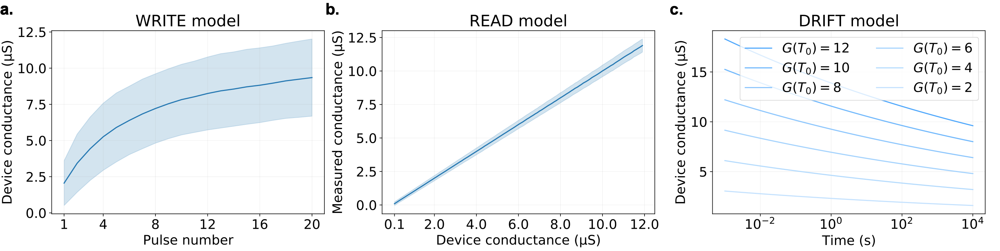

# SRNN-PCM

<center>

<br>
<i>Training spiking recurrent nets with PCM synapses</i><br/>
</center>
<p></p>


PyTorch implementation of _Online Training of Spiking Recurrent Neural Networks with Phase-Change Memory Synapses_ ([available on arXiv](https://arxiv.org/abs/2108.01804)). 

The SRNN-PCM repository has three main components:

- `xbar.py` implements the PCM crossbar array simulation framework.
- `srnn.py` implements a spiking recurrent neural network (SRNN) whose weights can be emulated using PCM devices.
- `train.py` trains the SRNN on a toy pattern generation task.

The SRNN-PCM uses [e-prop](https://www.nature.com/articles/s41467-020-17236-y) learning rule to estimate the ideal gradients of the SRNN weights during the training, in online manner. But PCM non-idealities such as WRITE noise, asymmetric update or low bit resolution prevent implementation of the ideal weight change even if the non-biased gradient information is available. The SRNN-PCM supports commonly used weight update schemes in neuromorphic circuits such as sign-gradient update, stochastic update, multi-memristor architecture and mixed-precision training to cope with these non-idealities and evaluate the performances of implemented methods.

---

#### Example Usage

The repository supports the training of SRNNs either with FP32 weights or PCM devices in the differential configuration. The following examples show how to train a SRNN with different weight update schemes.

- To train SRNN with a vanilla e-prop using FP32 weights : 

`python train.py --method vanilla`

- To train SRNN with e-prop but using sign-gradient method with PCM weights with stop learning regime : 

`python train.py --method sign --xbar True --grad_thr 0.9`

- To train SRNN with e-prop but using stochastic update method with PCM weights : 

`python train.py --method stochastic --xbar True --prob_scale 780`

- To train SRNN with e-prop but using multi-memristor method with 4 positive and 4 negative PCM devices per synapse : 

`python train.py --method multi-mem --xbar True --xbar_n 4`

- To train SRNN with e-prop but using mixed-precision method with PCM weights : 

`python train.py --method mixed-precision --xbar True`

Optionally, you can choose to disable WRITE, READ noises and DRIFT by enabling `perf-mode`. In this mode the weights will be ideal low-precision memory elements. For example, to have stochastic update with 6-bits memory elements in differential mode:

- To train SRNN with e-prop but using stochastic update method with 6-bits ideal weights (perf mode) : 

`python train.py --method mixed-precision --xbar True --perf True --xbar_res 6`

---

#### Comparison of Multi-Memristor Performances

To investigate how using multiple memristors in a differential configuration inside a single synapse affects the WRITE operation statistics (as shown in Supplementary Note 3), run:

`python xbar.py --write_method multi-mem --xbar_n 1`. 

The number of memristor pairs per synapse can be set by `--xbar_n 1,8,16` to replicate Fig. 9, Fig. 10 and Fig. 11, respectively.

---

#### PCM Device Model

<center>

<i>Implemented PCM model</i><br/>
</center>
<p></p>

PCM crossbar array simulation framework is developed based on the PCM device model introduced by [_Nandakumar, S. R. et al, 2018_](https://aip.scitation.org/doi/10.1063/1.5042408). Using our simulation framework, it is possible to reproduce some model figures from Nandakumar et al.


1. To replicate Figure 2: `python xbar.py --replicate 2`
2. To replicate Figure 5, change `Gmax` to 20 µS (GPU is preferred): `python xbar.py --replicate 5`
3. To replicate Figure 7: `python xbar.py --replicate 7`

---

#### Notes

Weight update schemes require different hyperparameters. The default hyperparameters works fine with vanilla e-prop training. For mixed-precision, following can be used:

`python train.py --cuda=true --lr_inp=0.00033040801301504577 --lr_out=1.662028909434269e-05 --lr_rec=0.00039387187486665526 --method=mixed-precision --perf=false --reg=0.0008382720865299505 --thr=0.19252357575425721 --w_init_gain=0.23687602686903747 --xbar=true --xbar_scale=11.82503110296963`


#### Acknowledgement

e-prop implementation is inspired by the PyTorch implementation from [Charlotte Frenkel](https://github.com/ChFrenkel).

#### Citation

```
@article{Demirag_etal21srnn, 
year = {2021}, 
title = {{Online Training of Spiking Recurrent Neural Networks with Phase-Change Memory Synapses}}, 
author = {Demirag, Yigit and Frenkel, Charlotte and Payvand, Melika and Indiveri, Giacomo}, 
journal = {arXiv}, 
eprint = {2108.01804}
}
```

---

#### License

MIT
